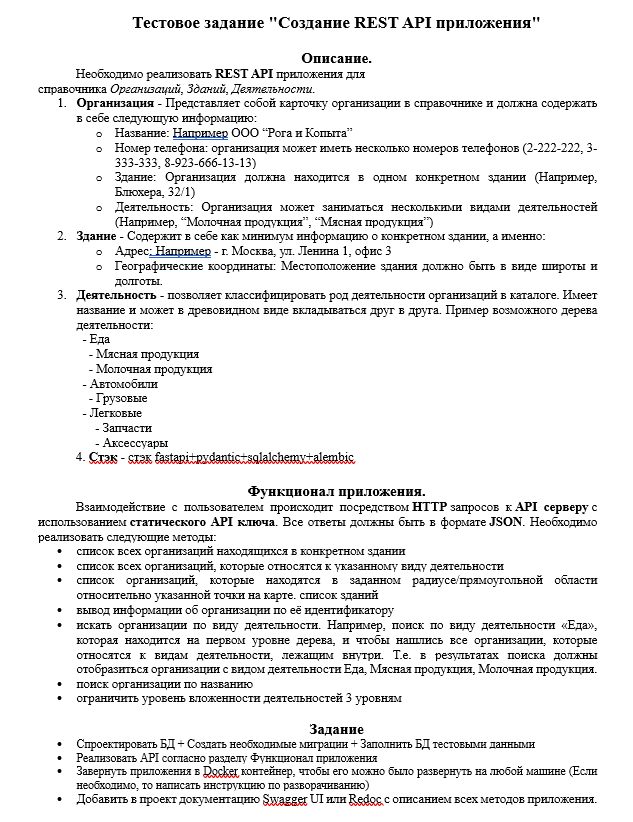

#Testovoe
Этот репозиторий был создан для решения тестового задания.

##ТЗ


##Запуск
    Для запуска нужен linux, git, docker и docker-compose.
Я использовал wsl Ubuntu с установленным docker и docker-compose.
```
    Distributor ID: Ubuntu
    Description:    Ubuntu 24.04.1 LTS
    Release:        24.04
    Codename:       noble
```
###Прописать команды
```
    git init
    git remote add origin https://github.com/AllGalI/testovoe.git
    git branch -m master main
    git pull origin main 
    touch .env
```

###Вставить это в .env
DATABASE_HOST=db
DATABASE_PORT=5432
DATABASE_USER=username
DATABASE_PASSWORD=pass
DATABASE_NAME=testovoe

###Запустить docker-compose
```docker compose up -d --build```

    Если во время поднятия контейнеров долго загружаются библиотеки
вкл/выкл vpn иногда причина в этом 

Теперь сервис доступен на http://localhost:8000
Swagger http://localhost:8000/docs
Redoc http://localhost:8000/redoc