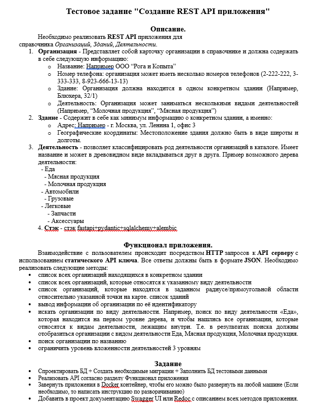

# Testovoe
Этот репозиторий был создан для решения тестового задания.

## ТЗ
<p align="center">
  
</p>

## Запуск
Для запуска нужен linux, git, docker и docker-compose.
Я использовал wsl Ubuntu с установленным docker и docker-compose.
```
    Distributor ID: Ubuntu
    Description:    Ubuntu 24.04.1 LTS
    Release:        24.04
    Codename:       noble
```
### Прописать команды
```
    mkdir /home/testovoe
    cd /home/testovoe/
    git init
    git remote add origin https://github.com/AllGalI/testovoe.git
    git branch -m master main
    git pull origin main 
    touch .env
```

### Вставить это в .env
    DATABASE_HOST=db
    DATABASE_PORT=5432
    DATABASE_USER=username
    DATABASE_PASSWORD=pass
    DATABASE_NAME=testovoe

### Как установить docker и docker compose
 sudo apt update
 sudo apt install curl software-properties-common ca-certificates apt-transport-https -y
 wget -O- https://download.docker.com/linux/ubuntu/gpg | gpg --dearmor | sudo tee /etc/apt/keyrings/docker.gpg > /dev/null
 echo "deb [arch=amd64 signed-by=/etc/apt/keyrings/docker.gpg] https://download.docker.com/linux/ubuntu jammy stable"| sudo tee /etc/apt/sources.list.d/docker.list > /dev/null
 sudo apt update
 apt-cache policy docker-ce
 sudo apt install docker-ce -y
### Запустить docker-compose
    docker compose up -d --build
    
Если во время поднятия контейнеров долго загружаются библиотеки
вкл/выкл vpn иногда причина в этом 

Теперь сервис доступен на

    http://localhost:8000
Swagger

    http://localhost:8000/docs
Redoc
    
    http://localhost:8000/redoc
